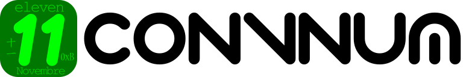

<p align="center"><a href="https://convnum.tomchen.org/"></a></p>

# ConvNum // Convert Numerals & Dates

TypeScript/JavaScript utility library for converting between various number representations, numeral systems, date formats, and more. Includes validation, type/format detection and formatting capabilities.

[](https://www.npmjs.com/package/convnum) [](https://www.npmjs.com/package/convnum?activeTab=versions) [](https://github.com/toolsu/convnum/actions) [](https://github.com/toolsu/convnum/blob/main/LICENSE) [](https://convnum.tomchen.org)

## Installation

```sh npm2yarn
npm install convnum
```

## Usage

```typescript
import { toEnglishWords, fromChineseWords } from "convnum";

console.log(toEnglishWords(12345)); // 'twelve thousand three hundred forty-five'
console.log(fromChineseWords("一万二千三百四十五")); // 12345
```

Detailed documentation is available at [https://convnum.tomchen.org](https://convnum.tomchen.org).

## Supported Types

The library supports validation, detection, and formatting of the following number representation types:

([`NumType`](https://convnum.tomchen.org/Numeral_Types/NumType) is a type used in this library to identify different number representations)

| Name                                                                            | [NumType](https://convnum.tomchen.org/Numeral_Types/NumType) | Examples                                  | Notes                                                                                                                                                                                                  |
| ------------------------------------------------------------------------------- | ------------------------------------------------------------ | ----------------------------------------- | ------------------------------------------------------------------------------------------------------------------------------------------------------------------------------------------------------ |
| Decimal                                                                         | `decimal` (alias: `dec`)                                     | "123", "456"                              | Standard base-10 numbers                                                                                                                                                                               |
| [Latin letters](https://convnum.tomchen.org/all#alphabet)                       | `latin_letter`                                               | "A", "b", "Z"                             | Standard Latin alphabet                                                                                                                                                                                |
| [Month](https://convnum.tomchen.org/all#date)                                   | `month_name`                                                 | "January", "JAN", "février", "1月"        | Month names in any language, via [`Intl`](https://developer.mozilla.org/en-US/docs/Web/JavaScript/Reference/Global_Objects/Intl). Detection is English-only by default; pass `getTypes(str, { locales })` to recognise other languages — see [Languages](#languages)                     |
| [Day of week](https://convnum.tomchen.org/all#date)                             | `day_of_week`                                                | "Monday", "MON", "lundi", "星期一"         | Day names in any language, via [`Intl`](https://developer.mozilla.org/en-US/docs/Web/JavaScript/Reference/Global_Objects/Intl). Detection is English-only by default; pass `getTypes(str, { locales })` to recognise other languages — see [Languages](#languages)                       |
| [Roman numerals](https://convnum.tomchen.org/all#roman-numeral)                 | `roman`                                                      | "VI", "vi", "MMMCMXCIX"                   | Roman numeral system (range: 1-3999). Does not support single Unicode character form like "Ⅵ"                                                                                                          |
| [Arabic numerals](https://convnum.tomchen.org/all#eastern-arabic-numeral)       | `arabic`                                                     | "٠", "١", "٢"                             | Eastern Arabic numerals                                                                                                                                                                                |
| [English words](https://convnum.tomchen.org/all#english-numeral)                | `english_words`                                              | "one hundred twenty-three", "thReE"       | Written English numbers                                                                                                                                                                                |
| [English ordinal words](https://convnum.tomchen.org/all#english-numeral)        | `english_ordinal_words`                                      | "first", "twenty-first", "ThIrD"          | Written English ordinal numbers                                                                                                                                                                        |
| [English ordinal abbreviation](https://convnum.tomchen.org/all#english-numeral) | `english_ordinal_abbr`                                       | "1st", "2Nd", "3RD"                       | English ordinal numbers with suffixes                                                                                                                                                                  |
| [French words](https://convnum.tomchen.org/all#french-numeral)                  | `french_words`                                               | "cent-vingt-trois", "TroIs"               | Written French numbers. Output uses the fully hyphenated 1990-reform form ("cent-vingt-trois"); input accepts both the reform and traditional ("cent vingt-trois") forms, with strictly official spelling (e.g. "quatre-vingt-mille", "deux-cent-mille") |
| [French ordinal words](https://convnum.tomchen.org/all#french-numeral)          | `french_ordinal_words`                                       | "premier", "vingt-et-unième", "TrOiSièMe" | Written French ordinal numbers ("mille-unième", not "mille-premier")                                                                                                                                   |
| [French ordinal abbreviation](https://convnum.tomchen.org/all#french-numeral)   | `french_ordinal_abbr`                                        | "1er", "1re", "2e", "3e"                  | French ordinal numbers with suffixes: "1er" (premier), "1re" (première), and "Ne" for every other number                                                                                              |
| [Chinese words](https://convnum.tomchen.org/all#chinese-numeral)                | `chinese_words`                                              | "一万三千零二", "一萬三千零二"            | Standard Chinese numerals (simplified and traditional Chinese)                                                                                                                                         |
| [Chinese financial](https://convnum.tomchen.org/all#chinese-numeral)            | `chinese_financial`                                          | "壹万叁仟零贰", "壹萬叄仟零貳"            | Traditional financial characters (simplified and traditional Chinese)                                                                                                                                  |
| [Binary](https://convnum.tomchen.org/all#bases)                                 | `binary` (alias: `bin`)                                      | "1010", "0B1101"                          | Base-2 numbers (0-1 only)                                                                                                                                                                              |
| [Octal](https://convnum.tomchen.org/all#bases)                                  | `octal` (alias: `oct`)                                       | "123", "0o456"                            | Base-8 numbers (0-7 only)                                                                                                                                                                              |
| [Hexadecimal](https://convnum.tomchen.org/all#bases)                            | `hexadecimal` (alias: `hex`)                                 | "1A", "abc", "0xFF"                       | Base-16 numbers (0-9, A-F)                                                                                                                                                                             |
| [Greek letters](https://convnum.tomchen.org/all#alphabet)                       | `greek_letter`                                               | "Α", "α", "Ω"                             | Greek alphabet                                                                                                                                                                                         |
| [Greek letter names](https://convnum.tomchen.org/all#alphabet)                  | `greek_letter_english_name`                                  | "Alpha", "BETA", "gamma"                  | English names of Greek letters (Alpha, Beta, Gamma, etc.)                                                                                                                                              |
| [Cyrillic letters](https://convnum.tomchen.org/all#alphabet)                    | `cyrillic_letter`                                            | "А", "а", "Я"                             | Cyrillic alphabet                                                                                                                                                                                      |
| [Hebrew letters](https://convnum.tomchen.org/all#alphabet)                      | `hebrew_letter`                                              | "א", "ב", "ת"                             | Hebrew alphabet (22 standard letters, no upper/lower case distinction; no Final Forms)                                                                                                                 |
| [Chinese Heavenly Stems](https://convnum.tomchen.org/all#chinese-numeral)       | `chinese_heavenly_stem`                                      | "甲", "乙", "丙"                          | 天干 (Tiān Gān) (always same character in simplified and traditional Chinese)                                                                                                                          |
| [Chinese Earthly Branches](https://convnum.tomchen.org/all#chinese-numeral)     | `chinese_earthly_branch`                                     | "子", "丑", "寅"                          | 地支 (Dì Zhī) (always same character in simplified and traditional Chinese)                                                                                                                            |
| [Chinese Solar Terms](https://convnum.tomchen.org/all#chinese-numeral)          | `chinese_solar_term`                                         | "立春", "惊蛰", "驚蟄"                    | 节气 (Jié Qì) (simplified and traditional Chinese)                                                                                                                                                     |
| [Astrological signs](https://convnum.tomchen.org/all#astrological-sign)         | `astrological_sign`                                          | "Aries", "tauRuS"                         | Zodiac signs                                                                                                                                                                                           |
| [NATO phonetic](https://convnum.tomchen.org/all#alphabet)                       | `nato_phonetic`                                              | "Alfa", "alpha", "braVo", "Charlie"       | NATO phonetic alphabet                                                                                                                                                                                 |

**Special types:**
| Name | NumType | Examples | Notes |
|------|---------|----------|-------|
| Invalid | `invalid` | `null`, `undefined` | Any non-string inputs (type errors) |
| Empty | `empty` | `""`, `"   "` | Empty or whitespace-only strings |
| Unknown | `unknown` | "xyz", "!@#$" | Non-empty strings that don't match any type |

**Note:**

- Julian day ([Wikipedia](https://en.wikipedia.org/wiki/Julian_day)) is supported only for conversion, not for detection, and is therefore not included in the `NumType` type.
- `parseDateString` and `formatDateString` are date functions, not number representations and not included in the `NumType` type. The two functions are used for precise parsing and formatting of date strings. They read and write `2023-12-25`, `25.12.2023`, `Dec 25, 2023`, `2023-12`, and the suffix-labelled layouts `2023年12月25日` and `2023년 12월 25일`, keeping whatever padding and spacing the input had.
- **Type Aliases**: For convenience, the base number types support shorter aliases when using `convertFrom()` and `convertTo()`: `hex` for `hexadecimal`, `bin` for `binary`, `oct` for `octal`, and `dec` for `decimal`. Aliases work both as a bare string (e.g. `convertTo(255, 'hex')`) and as the `type` field of a `TypeInfo` object (e.g. `convertTo(255, { type: 'hex' })`).

## Languages

Month and weekday names exist in every language, and `toMonth` / `toDayOfWeek` have always
written them in any of them. Reading them back is opt-in, because which languages to
consider is a decision only the caller can make:

```ts
import { DEFAULT_LOCALES, getTypes, convertFrom, convertTo } from 'convnum'

getTypes('janvier')                              // [{ type: 'unknown' }]
getTypes('janvier', { locales: DEFAULT_LOCALES })
// [{ type: 'month_name', case: 'lower', format: 'long', locale: 'fr' }]

getTypes('janvier', { locales: ['de', 'es'] })   // [{ type: 'unknown' }]
```

The default stays English-only, so nothing that worked before changes. `DEFAULT_LOCALES`
is a list of about forty languages a text editor is realistically used in; pass your own
to narrow or widen it, most preferred first.

A `TypeInfo` then carries the language it was read in, and `convertFrom` / `convertTo`
work in that language, keeping the case and the long-or-short form:

```ts
const info = getTypes('MAYIS', { locales: DEFAULT_LOCALES })[0]
convertTo(convertFrom('MAYIS', info) + 2, info)  // 'TEMMUZ'  (Turkish, uppercased Turkishly)
```

### Ambiguity

A name can belong to several languages. `getTypes` reports every reading, most preferred
first, so a caller holding two ends of a range can intersect them and settle it without
guessing:

```ts
matchLocalisedName('mars', 'month').map((m) => m.locale)  // ['fr', 'sv', 'nb']
```

Across the default list only five month names read as a *different month* in a different
language, all from the same source: Croatian's month names are shifted a month against
Polish and Czech, so `listopad` is November in Polish and Czech and October in Croatian.

### Grammatical case

Several languages put a month in a different case inside a date than they use for it on
its own — Russian `январь` alone and `января` in a date, Greek `Ιανουάριος` and
`Ιανουαρίου`, Finnish `tammikuu` and `tammikuuta`. Both forms are recognised; the
standalone form is what anything is written back as.

Dates themselves are a different matter. `parseDateString` reads *numeric* dates in any
language, since digits and separators are language-neutral, and it reads the East Asian
layouts that label each field with a suffix — `2023年12月25日`, `2023년 12월 25일`,
`2023年12月`, `12月25日` — which are unambiguous for the same reason: nothing has to be
guessed about field order.

A date with the month *spelled out* stays English-only. Supporting more would mean
enumerating the in-date forms of the month, which `Intl` offers no way to do — several
languages inflect them, as above — on top of the fact that abbreviations in French
(`déc.`) and Thai (`ม.ค.`) contain the full stop that also separates date fields.

## Features

- **Conversion, validation, detection, and formatting** functions for all supported types
- **Robust error handling** for invalid or unexpected inputs
- **Thorough test coverage**, including edge cases and uncommon scenarios
- **Full support for:**
  - Zero, negative values, large numbers (up to quintillions), and other edge cases
  - Multiple locales and number formats
  - Simplified ⇄ Traditional Chinese conversion (limited to characters used in this library)
  - Case-insensitive input across all functions
  - Zero runtime dependencies
  - Tree-shakable builds (when using specific functions — not the all-in-one version — with ES modules and a proper bundler)

## Changelog

See [CHANGELOG.md](CHANGELOG.md)

## License

MIT
